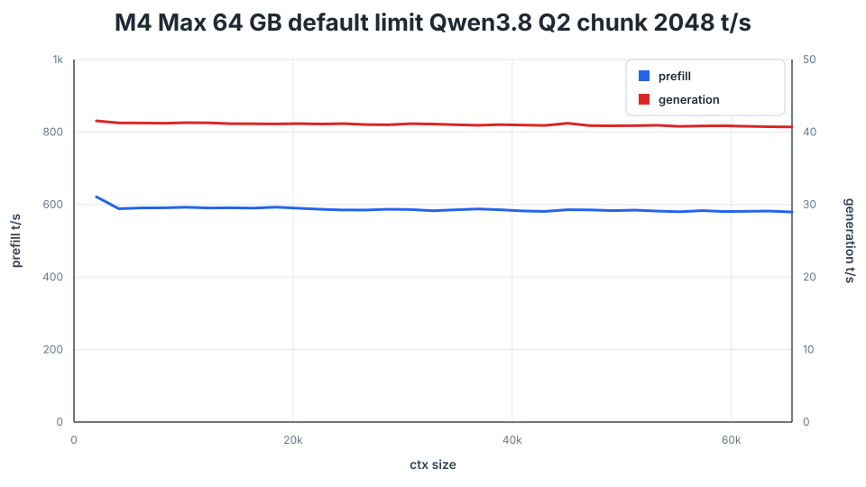

# What a 64 GB Mac actually does with big local models: measured

**Measured on this machine, never estimated.** Every number below comes from a benchmark run
whose raw output is in [`results/`](results/). Each row carries its date, model, quant, engine
commit and flags. The machine is a Mac Studio with an M4 Max and 64 GB of unified memory.
New models and engine releases get new dated rows; old rows stay.

## Stock 64 GB Mac (macOS default GPU memory limit)

On 2026-09-28, **Qwen3.8 Flash Next Q2** ran the full official DwarfStar (ds4) context sweep, 2K→64K
tokens, at **~580–620 t/s prefill and ~41 t/s generation**. That was at the macOS default GPU memory
limit (measured at 51.84 GiB on this Mac) with `--prefill-chunk 2048`: 3 of 3 runs, no swapping, no
change to system settings.

| Date | Model, quant | Engine | GPU limit | Flags | Valid runs | Prefill t/s at 2K / 16K / 32K / 64K | Generation t/s at 2K / 16K / 32K / 64K |
|---|---|---|---|---|---:|---|---|
| 2026-09-28 | Qwen3.8 Flash Next, Q2 | ds4 `0aaea5a` | default (51.84 GiB) | `--prefill-chunk 2048` | 3 of 3 | 621.3 / 590.1 / 583.4 / 579.4 | 41.54 / 41.14 / 41.10 / 40.70 |
| 2026-09-28 | Qwen3.8 Flash Next, Q2 | ds4 `0aaea5a` | default (51.84 GiB) | none (official command), **1 probe run** | 1 of 1 | 615.8 / 590.3 / 581.3 / 577.4 | 41.29 / 41.01 / 40.74 / 40.63 |



- **Recommendation for a stock 64 GB Mac:** use `--prefill-chunk 2048`. ds4 plans 46.11 GiB with
  it and 52.05 GiB without, and the second is 0.21 GiB over the default limit.
- **The unmodified command did not swap in its one run**, but that run had no headroom on paper,
  so it is one observation, not a guarantee.

## Raised GPU memory limit (`iogpu.wired_limit_mb=57344`, 56.00 GiB)

| Date | Model, quant | Engine | Mode | Flags | Valid runs | Prefill t/s at 2K / 16K / 32K / 64K | Generation t/s at 2K / 16K / 32K / 64K |
|---|---|---|---|---|---:|---|---|
| 2026-09-28 | Qwen3.8 Flash Next, Q2 | ds4 `0aaea5a` | resident | none (official command) | 3 of 3 | 616.4 / 590.6 / 581.8 / 579.5 | 41.24 / 40.98 / 40.81 / 40.34 |
| 2026-09-28 | Qwen3.8 Flash Next, Q2 | ds4 `0aaea5a` | resident | `--prefill-chunk 2048` | 2 of 4 | 621.3 / 590.0 / 583.4 / 579.8 | 41.15 / 40.90 / 40.84 / 40.48 |
| 2026-09-28 | DeepSeek V4 Flash, Q2 | ds4 `0aaea5a` | streamed from SSD | `--ssd-streaming` | 3 of 4 | 156.0 / 138.2 / 138.0 / 123.1 | 12.85 / 15.59 / 14.83 / 14.39 |

Each value is the median of the valid runs. The per-run values, min–max ranges and all 32
frontiers are in [`results/2026-09-28/`](results/2026-09-28/). DeepSeek prefill is not stable:
every run has intermittent drops, and one run fell to ~48 t/s at 57K–63K. Read its range, not
only its median.

### Process start to first token (not part of the official format)

A 2,048-token prompt at the raised limit; "cold" means after `sudo purge`. Median of 3 pairs.

| Date | Model | Cold | Warm |
|---|---|---:|---:|
| 2026-09-28 | Qwen3.8 Flash Next Q2 (official command) | 23.7 s | 3.7 s |
| 2026-09-28 | DeepSeek V4 Flash Q2, `--ssd-streaming` | 18.2 s | 13.8 s |

## What these numbers are, and are not

- **Method:** ds4's own `ds4-bench` with the documented sweep:
  `--prompt-file speed-bench/promessi_sposi.txt --ctx-start 2048 --ctx-max 65536 --step-incr 2048 --gen-tokens 128`.
  Each row at a context size measures the newest 2,048-token prefill interval and a 128-token greedy
  generation probe. Generation is `gen_tps` (all 128 tokens), the column upstream plots.
- **Conditions:** a quiet machine (other LLM servers stopped, scheduled jobs paused), alternating
  order, 120 s cooldowns, and runs with more than 100 MiB of system-wide swap-ins excluded. The
  rules were fixed before the runs; see [METHODOLOGY.md](METHODOLOGY.md).
- **What doesn't compare:**
  - The Qwen and DeepSeek rows are different models.
  - The streamed DeepSeek row is not comparable with resident DeepSeek numbers from 128 GB
    machines, for example upstream's `docs/PERFORMANCE.md`.
  - Plain `ds4-bench` decoding is not `ds4-server` with `--mtp` speculative decoding, which is
    faster on predictable text.
  - Other chips are other chips.
- **Upstream submission:** the same data is in [antirez/ds4 PR #1142](https://github.com/antirez/ds4/pull/1142).

## Reproduce

```sh
git clone https://github.com/antirez/ds4 ~/src/ds4 && cd ~/src/ds4
git checkout 0aaea5a238fb41a35106a551e73c8409dfb751ac && make ds4-bench
./download_model.sh qwen38-q2            # 137 GiB; ds4f-q2 (81 GiB) for the DeepSeek row

cd /path/to/64gb-mac-llm-bench
cp scripts/bench.conf.example bench.conf  # set DS4_DIR (and QUIET_HOOK if you use one)
BENCH_CONF=bench.conf CONFIGS=qwen-chunk2048 DRY_RUN=1 scripts/run-bench.sh    # preflight only
BENCH_CONF=bench.conf CONFIGS=qwen-chunk2048 STOP_AT=06:00 nohup scripts/run-bench.sh >/dev/null 2>&1 &
python3 scripts/summarize.py results/local/<run-dir> > my-summary.md
```

ds4 compiles its Metal shaders at runtime from relative paths (`metal/*.metal`), so `ds4-bench`
must run with the ds4 checkout as its working directory. The driver does this for you. For the default-limit
sweep, add `WIRED_LIMIT=0 RESTORE_LIMIT=<your value>`; this needs passwordless `sudo` for exactly
those two `sysctl` commands. See METHODOLOGY.

## Files

- [METHODOLOGY.md](METHODOLOGY.md): the protocol, the validity, replacement and representative-run
  rules, what was excluded from this repo and why.
- [HISTORY.md](HISTORY.md): a dated log of runs and changes.
- `results/<date>/`: per-run CSVs, engine reports with `time -l`, 5-second memory/disk samples,
  run tables, redacted driver logs, summaries and charts.
- `scripts/`: the driver, summariser, first-token probe, the Metal working-set helper, a config
  example and an example quieting hook.

## Credits

Measured on pswai's Mac Studio and maintained by pswai. The benchmark was built with
**[Claude Code](https://claude.com/claude-code)** (Anthropic): the run plan, the driver and
probes, the runs themselves, the analysis and this write-up. pswai directed the work, set the
quiet-machine windows and approved every change to the machine. Every published number was
re-derived from the raw CSVs by a separate check.

## License

Code (`scripts/`) is MIT, see [LICENSE](LICENSE). The benchmark data and documentation (`results/`
and the Markdown files) are CC BY 4.0: reuse them with attribution to pswai.
